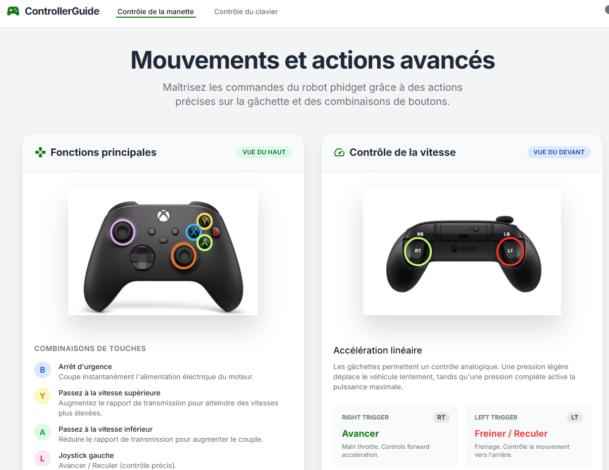

# Projet Module 306 – Réaliser un petit projet informatique

## 📌 Description du projet

Ce repository contient le travail réalisé dans le cadre du **module 306 : Réaliser un petit projet informatique**, destiné aux **informaticiens CFC**. Le projet est effectué par **un groupe de 4 apprenants**, qui collaborent pour concevoir, développer et documenter une petite application informatique complète.

L’objectif principal est de mettre en pratique les compétences liées à la gestion de projet, au développement, à la documentation et à la collaboration au sein d’une équipe.

---

## 📁 Structure du repository

Le repository s’organise en deux dossiers principaux :

### **1. `/code`**

Contient l’intégralité du code source du projet. Selon la nature du projet, ce dossier peut inclure :

* Le backend
* Le frontend

### **2. `/documentation`**

Ce dossier regroupe tous les documents produits dans le cadre du projet, notamment :

#### **2.1 Business Case**

Présentation du contexte, du besoin initial, des objectifs et de la justification du projet.

#### **2.2 Cahier des charges**

Définition claire et structurée des exigences fonctionnelles et non fonctionnelles, ainsi que des contraintes du projet.

#### **2.3 Documentation**

Documentation générale du projet, expliquant son fonctionnement, son architecture, les choix techniques, etc.

* **3.1 Journal** : Journal de bord retraçant l’avancement du projet au fil des séances (tâches effectuées, difficultés, décisions, etc.)
* **3.2 Planning** : Planning prévisionnel et/ou réel du projet, sous forme de tableau, diagramme ou autre.

#### **2.4 Web Summary**

Résumé final du projet sous forme de page web ou de document de synthèse, destiné à présenter le résultat de manière claire et visuelle.

---

## 👥 Équipe de projet

Le projet est réalisé par un groupe composé de **4 apprenants informaticiens CFC**.
Chaque membre participe activement à la conception, au développement et à la documentation du projet.

Vous pouvez ajouter ici les noms des membres :

* Luuk Müller
* Théo Pasquier
* Andrei Pires Donose
---

## 🛠️ Technologies et outils utilisés

Liste des technologies, frameworks et outils utilisés pour développer et documenter le projet. Par exemple :

* Langage(s) : Javascript
* Framework(s) : TailWindCSS
* Outils de gestion de versions : GitHub
* Gestion de projet : Planning, journal, réunions

---

## 🚀 Installation et exécution

Tout d'abord Il vous faut lancer votre serveur et votre client depuis VSCode car c'est une application en local :


Dès que vous arriverez sur la page de Dashboard du client, veuillez brancher le Dongle de connexion puis vous connectez au "7Links" (mdp : #326IsBest#) du Rover.

Dès que cela est effectué, entrer l'URL du backend puis envoyer les informations essentielles (IP & Port) du robot aux serveur pour pouvoir le contrôler.


Ensuite veuillez choisir si vous voulez contrôler votre robot avec une manette Xbox One ou le clavier de votre ordinateur.


Vous pouvez, dès l'accès aux modes, consulter le guide pour connaître comment fonctionne les différentes touches et inputs de la manette sur le robot.



---

## 📄 Documentation

L'ensemble de la documentation complète est disponible dans le dossier `/documentation`. Référez-vous aux fichiers pour plus de détails sur :

* Le besoin et les objectifs
* Les exigences du projet
* L’architecture
* Le fonctionnement interne
* Le déroulement du projet

---

## RELEASE

Chaque semaine, une release est créée 

Terminal VS Code pour le tag et le push : 
```bash
git tag -a S1 -m "Release S1"
git push origin S1
```
---

## 📬 Contact

Pour toute question concernant le projet, veuillez contacter les membres du groupe ou le formateur responsable du module 306.

* **Project Owner**: Théo Pasquier, `Theo.Pasquier@studentfr.ch`
* **Scrum Master**: Andrei Pires Donose, `Andrei.PiresDonose@studentfr.ch` 
* **Testeur**: Luuk Müller, `Luuk.Mueller@studentfr.ch`
* **Dévéloppeurs**: Tout le monde

---

Merci d’avoir consulté ce repository ! 🚀
